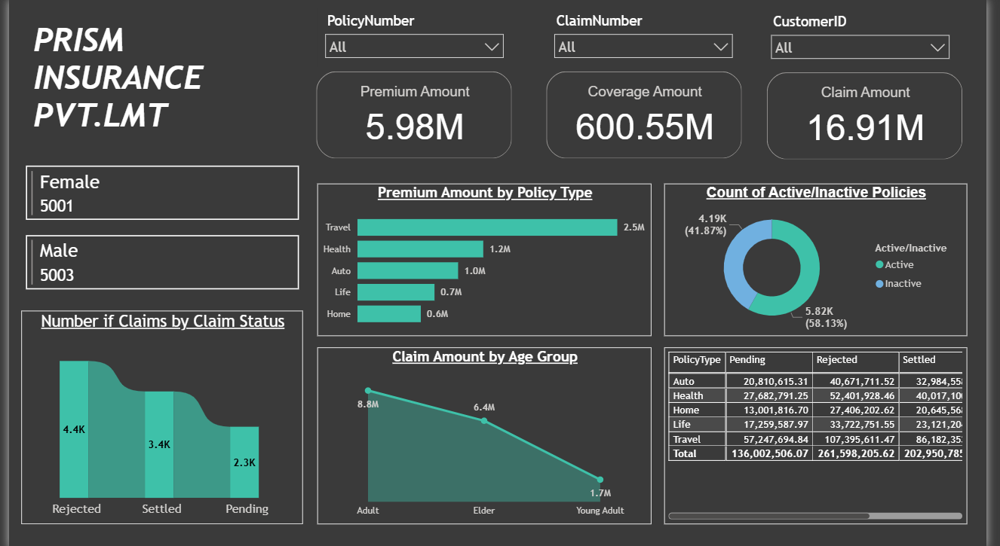
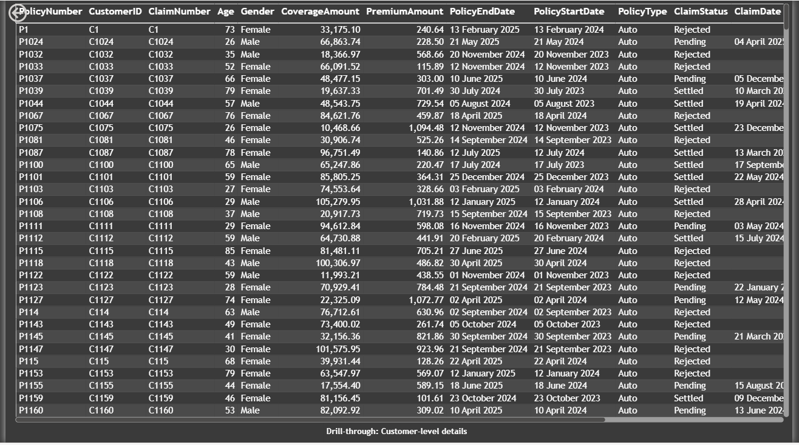
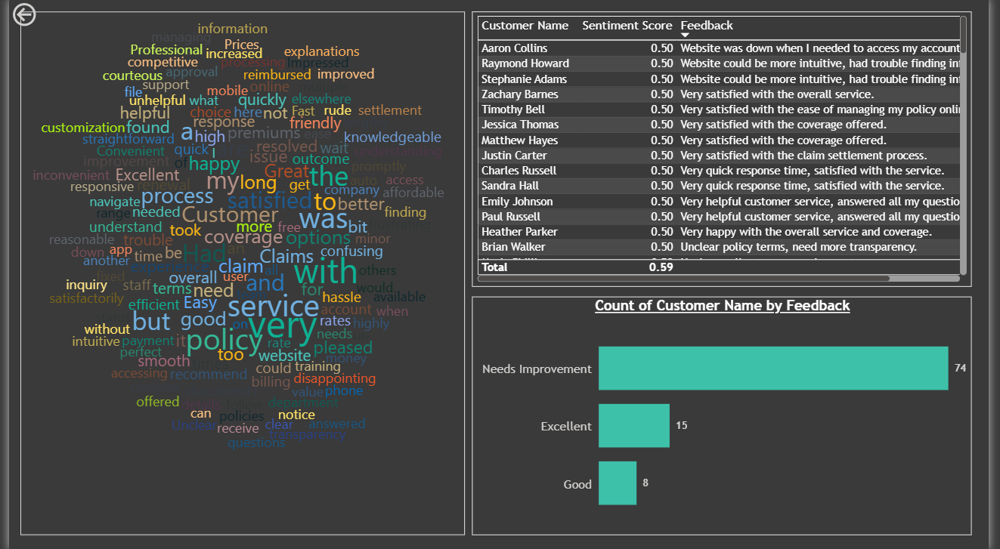

# 🛡️ Insurance Data Analysis Dashboard (Power BI Learning Project)

This is a **3-page Power BI report** built as part of my hands-on learning journey in **Power BI + data analytics**.  
The dashboard is designed with a clear flow: **Business Overview → Customer-Level Drill-through → Feedback & Sentiment Insights**. :contentReference[oaicite:0]{index=0}

## 📌 Project Overview
Insurance businesses deal with multiple moving parts—policies, customers, claims, coverage, and claim statuses.  
This project converts an insurance dataset into an interactive report that helps users:
- track premium, coverage, and claim amounts,
- understand claim status distribution (Rejected / Settled / Pending),
- drill into customer-level records,
- explore customer feedback using a **Word Cloud** + simple sentiment scoring. :contentReference[oaicite:1]{index=1}

## 🎯 Problem Statement
Build a Power BI report to support both **high-level decision making** and **detailed investigation** by enabling:
- a summary view for overall policy/claim performance,
- drill-through navigation to customer-level details,
- insights from customer feedback (sentiment + common words). :contentReference[oaicite:2]{index=2}

## 📊 Key KPIs (Business Overview)
From the Overview page:
- **Premium Amount:** 5.98M  
- **Coverage Amount:** 600.55M  
- **Claim Amount:** 16.91M :contentReference[oaicite:3]{index=3}

Additional overview insights:
- Claims by status (Rejected / Settled / Pending)
- Premium amount by policy type (Travel, Health, Auto, Life, Home)
- Claim amount by age group (Adult, Elder, Young Adult)
- Active vs Inactive policy distribution :contentReference[oaicite:4]{index=4}

## 🧩 Dashboard Pages

### 1) Business Overview (Executive Summary)
This page provides a high-level snapshot of the insurance business with:
- KPI cards (Premium, Coverage, Claim Amount)
- Claims by status
- Premium by policy type
- Claim amount by age group
- Active vs inactive policies
- Filters for PolicyNumber, ClaimNumber, CustomerID :contentReference[oaicite:5]{index=5}

### 2) Drill-through: Customer-Level Details
This page is designed for detailed analysis. Using drill-through, users can view full customer/policy records based on the selected context.

Includes fields like:
- PolicyNumber, CustomerID, ClaimNumber, Age, Gender
- CoverageAmount, PremiumAmount
- PolicyStartDate, PolicyEndDate
- PolicyType, ClaimStatus, ClaimDate :contentReference[oaicite:6]{index=6}

### 3) Customer Feedback & Sentiment Insights
This page focuses on customer experience using:
- **Word Cloud** to highlight common feedback themes (e.g., service, policy, claim, website, helpful, confusing, etc.)
- A table with **Customer Name + Sentiment Score + Feedback**
- Feedback category distribution (Needs Improvement / Good / Excellent) :contentReference[oaicite:7]{index=7}

## 🔧 Workflow (What I Did)
1. Imported the dataset into **Power BI**
2. Cleaned and structured the data (basic transformations + formatting)
3. Built measures for KPIs and breakdowns (Premium, Coverage, Claim Amount, counts)
4. Designed the report in a clear flow:
   - Summary view → Drill-through details → Feedback insights
5. Implemented **Drill-through navigation** for customer-level records
6. Added a **Word Cloud** visual and simple sentiment-focused exploration for feedback analysis :contentReference[oaicite:8]{index=8}

## 🧠 Skills Used
- Power BI (dashboard design + report building)
- DAX (basic measures for KPIs and comparisons)
- Drill-through functionality (summary → detailed records)
- Data visualization & layout (executive dashboard style)
- Customer feedback analysis (Word Cloud + sentiment view) :contentReference[oaicite:9]{index=9}
